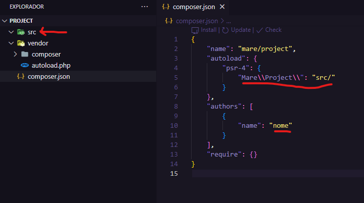

<h1 align="center">
    
</h1>
<h4 align="center"> 
# Estrutura de pastas - MVC 
</h4>

## 💻 Sobre o projeto

♻ ️Estrutura de pastas - Esse exemplo de estrutura de pasta em MVC basica.

## Como montar -passo a passo:

    1- Primeiro iremos usar o composer para iniciar o projeto, na raiz a pasta que você que colocar o projeto, digita;
    
         $ composer init

    dar enter ate terminar o processo, o composer irar criar a sequinte estrutura:

<h1 align="center">
    
</h1>

    2- Segundo, e so renomer a parta /src para /app  e colocar realmente qua pasta o autoload vai procurrar suas classe do projeto e o nome do autor;

    3- Terceiro, adicionar todas as pasta e arquivos comforme o exemplo de estrutura de pasta em MVC.

    OBS.: ESSE EXEMPLO DE ESTRUTUTA DE PASTA SERVE PARA MAIORIA DOS PROJETOS WEB, SENDO ASSSIM MUITO UTIL PRA QUEM ESTA COMEÇANDO E NAO TEM IDEIA DE COMO ESTRUTURAR AS PASTA DE UM PROJETO MVC EM PHP E OU TAMBEM EM OUTRAS LINGUAGENS.

## 📝 Licença

    Este projeto esta sobe a licença MIT.

    Feito com ❤️ por Marcos Andre 👋🏽 [Entre em contato!](https://www.linkedin.com/in/mare-marcos-andre/)

